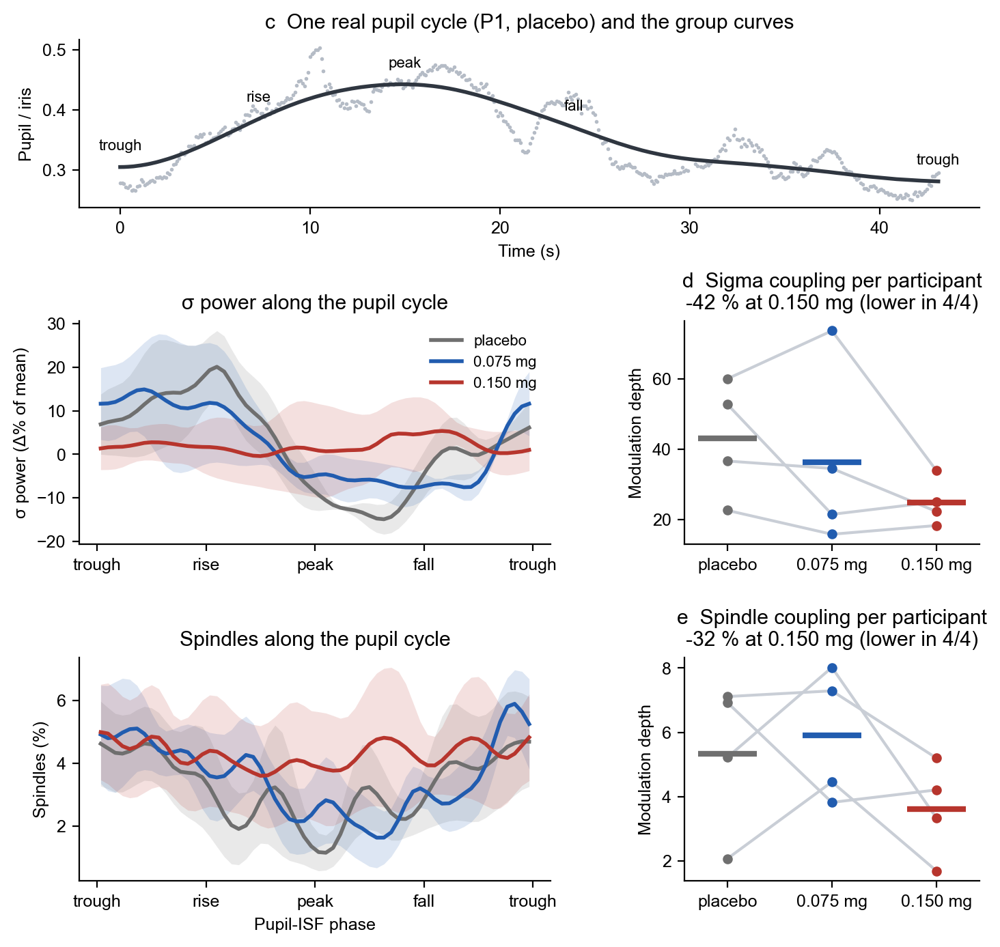

# Check what we do in [Brain-Body Regulation Lab](https://bbr.ethz.ch) and [Neural Control of Movement Lab](https://ncm.hest.ethz.ch)

<p align="center">
  <a href="https://bbr.ethz.ch"></a>
  <a href="https://ncm.hest.ethz.ch"></a>
</p>

# Same rhythms, lost coupling 👁️💤

Hi there! 👋 You probably landed here by scanning the QR code on our **ESRS 2026 poster (#378)**. Welcome to its
backstage: the numbers behind every panel, plus one small script that turns them into the figures.

**Noradrenergic suppression may uncouple pupil size from the infraslow sigma rhythm of human sleep**<br>
Vales Cortina I, Carro Domínguez M, Saxer D, Luciani M, Stiefel M, Wenderoth N, Meissner S, Lustenberger C

## The story in 30 seconds

- 😴 Four brave volunteers took three naps each while we filmed their pupil. Before each nap they got either
  placebo or clonidine (0.075 or 0.150 mg), a drug that turns down noradrenaline, the brain's "stay alert"
  messenger.
- 🔁 The pupil kept doing its thing: smaller in deep sleep, and slowly growing and shrinking about once every
  50 s. Sigma power (the spindle band of the EEG) kept its own slow rhythm too.
- 💔 Under placebo, sigma power and spindles danced along with the pupil's rhythm. With 0.150 mg they stopped
  following it.

| How much it follows the pupil | placebo | 0.150 mg | change |
|---|---|---|---|
| Sigma power | 43.0 | 24.8 | −42 %, lower in all 4 people (g<sub>z</sub> = −1.20) |
| Spindles | 5.3 | 3.6 | −32 %, lower in all 4 people (g<sub>z</sub> = −1.28) |

## Wait, what does "coupling" mean here? 🤔

Picture the pupil's slow cycle: trough → rise → peak → fall → trough. We tag every moment of NREM sleep with
where the pupil is in that cycle, and then ask: is sigma power (or the chance of a spindle) higher at some points
of the cycle than at others?

The **modulation depth** is the gap between the highest and the lowest point of that curve. Big gap = sigma
really moves with the pupil. Flat line = they ignore each other.



## What's in the box 📦

| Folder | What's inside |
|---|---|
| `data/` | the numbers behind each panel (CSV files; participants are P1–P4) |
| `code/make_figures.py` | one script that does all the stats and draws all the figures |
| `results/` | what the script makes: 4 figures named after the poster sections, `effects.csv` (every effect size), `modulation_depth.csv` |
| `METHODS.md` | the nerdy details, in one page 🤓 |

Which panel comes from where:

| On the poster | Data | Function | Figure in `results/` |
|---|---|---|---|
| 1 · pupil vs aperiodic exponent | `pupil_vs_exponent.csv` | `pupil_and_exponent()` | `1_pupil_and_exponent.png` |
| 3a · pupil size per stage | `pupil_by_stage.csv` | `same_rhythms()` | `3ab_same_rhythms.png` |
| 3b · rhythms vs placebo | `rhythms.csv` | `same_rhythms()` | `3ab_same_rhythms.png` |
| 3c · one real pupil cycle + group curves | `example_cycle.csv`, `phase_curves.csv` | `lost_coupling()` | `3cde_lost_coupling.png` |
| 3d, 3e · coupling per participant | `phase_curves.csv` | `lost_coupling()` | `3cde_lost_coupling.png` |
| 4 · sleep | `sleep.csv` | `sleep()` | `4_sleep.png` |

## Try it yourself 🧪

You need Python 3.9 or newer. Then:

```bash
pip install -r code/requirements.txt
python code/make_figures.py
```

A few seconds later the key numbers of the poster pop up on your screen, and the figures land in `results/`.

## What's NOT here 🔒

No raw EEG, no eye videos and no pictures of anyone's face. Those stay with us to protect our volunteers.
Everything here is already boiled down to the numbers you see on the poster.

## Credit & contact

Code: MIT licence. Data: CC BY 4.0. If you use any of it, a citation of the poster makes us happy:
Vales Cortina I, et al. *Noradrenergic suppression may uncouple pupil size from the infraslow sigma rhythm of
human sleep.* ESRS 2026, poster 378.

Questions, ideas, or just want to chat about pupils? ✉️ ibon.valescortina@hest.ethz.ch<br>
Brain Body Regulation Lab, ETH Zurich · funded by the Swiss National Science Foundation (TMSGI1_226129)
