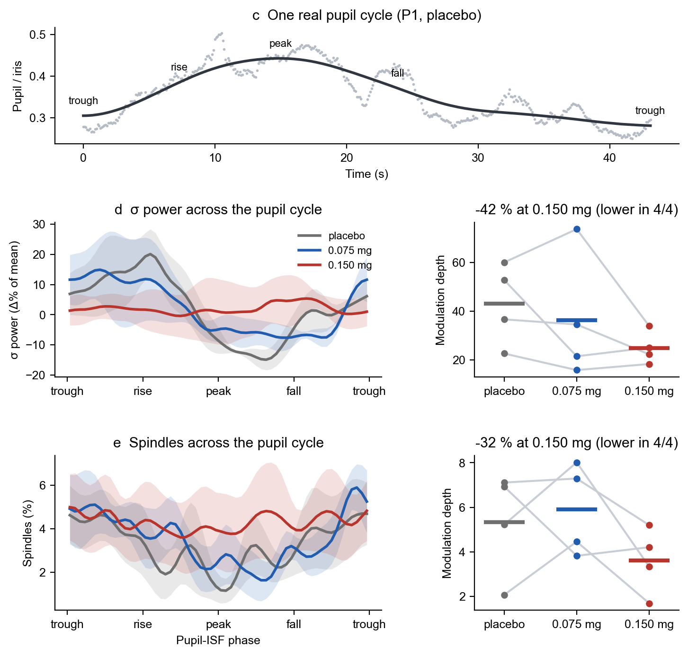

# Same rhythms, lost coupling

**Noradrenergic suppression may uncouple pupil size from the infraslow sigma rhythm of human sleep**
Vales Cortina I, Carro Domínguez M, Saxer D, Luciani M, Stiefel M, Wenderoth N, Meissner S, Lustenberger C
ESRS 2026 

## In one minute

- **Pilot:** 4 healthy adults, three 90-min naps each: placebo, 0.075 mg or 0.150 mg clonidine (an α2-agonist that
  dampens noradrenaline release). Double-blind, placebo-controlled crossover.
- **Same rhythms:** pupil size still fell from wake to deep sleep. The ~50-s (infraslow) rhythms of the pupil and of
  sigma power were still there under clonidine.
- **Lost coupling:** under placebo, sigma power and spindles rose and fell with the pupil's rhythm. Under 0.150 mg
  they no longer followed it.

| Coupling to the pupil cycle | placebo | 0.150 mg | change | Hedges' g<sub>z</sub> |
|---|---|---|---|---|
| Sigma power (modulation depth, % of mean) | 43.0 | 24.8 | −42 %, lower in 4 of 4 | −1.20 |
| Spindles (modulation depth, % points) | 5.3 | 3.6 | −32 %, lower in 4 of 4 | −1.28 |

## What is "coupling" here?

For each nap, every moment of NREM sleep is labelled with the phase of the pupil's infraslow cycle
(trough → rise → peak → fall → trough). We then average sigma power, or the chance of being in a spindle,
in each of 60 phase bins. The **modulation depth** is the highest minus the lowest point of that curve: how much
sigma power (or spindles) goes up and down with the pupil. A flat curve means no coupling.



## What is in here

| Folder | What |
|---|---|
| `data/` | the numbers behind each panel (CSV; participants are P1–P4) |
| `code/make_figures.py` | one script: all statistics and figures, one function per part of the poster |
| `results/` | what the script writes: 4 figures, `effects.csv` (every effect size), `modulation_depth.csv` |
| `METHODS.md` | how the data were recorded and computed, in one page |

| Data | In `make_figures.py` | Figure |
|---|---|---|---|
| 1 · pupil vs aperiodic exponent | `pupil_vs_exponent.csv` | `pupil_and_exponent()` | `fig1_pupil_and_exponent.png` |
| 3a · pupil size per stage | `pupil_by_stage.csv` | `same_rhythms()` | `fig2_same_rhythms.png` |
| 3b · rhythms vs placebo | `rhythms.csv` | `same_rhythms()` | `fig2_same_rhythms.png` |
| 3c–e · coupling | `example_cycle.csv`, `phase_curves.csv` | `lost_coupling()` | `fig3_lost_coupling.png` |
| 4 · sleep | `sleep.csv` | `sleep()` | `fig4_sleep.png` |

## Run it

Python 3.9 or newer:

```bash
pip install -r code/requirements.txt
python code/make_figures.py
```

It takes a few seconds and prints the key numbers of the poster.

## What is not here

No raw EEG, no eye videos and no images of participants: they stay with the lab to protect the participants'
privacy. These files hold only values derived from them.

## Licence, citation, contact

Code: MIT licence (`LICENSE`). Data: CC BY 4.0. If you use them, please cite the poster: Vales Cortina I, et al.
*Noradrenergic suppression may uncouple pupil size from the infraslow sigma rhythm of human sleep.* ESRS 2026,
poster 378.

Ibon Vales Cortina · ibon.valescortina@hest.ethz.ch · Brain Body Regulation Lab, ETH Zurich.
Funded by the Swiss National Science Foundation (TMSGI1_226129).
